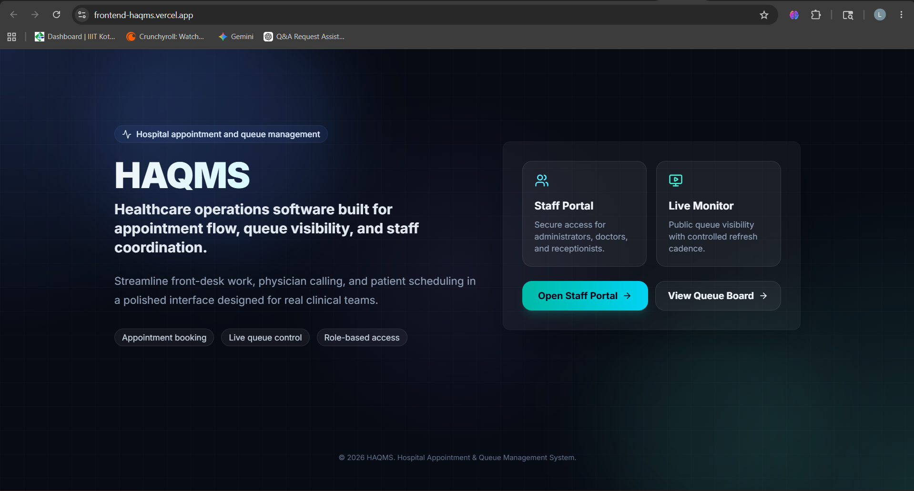
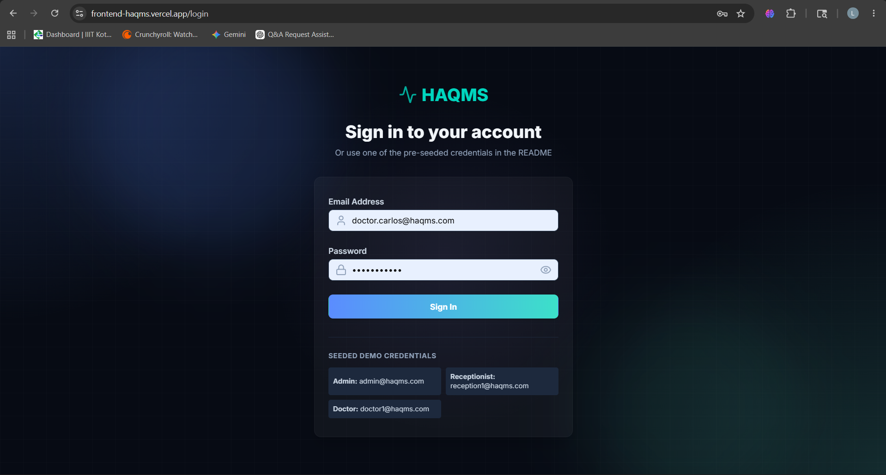
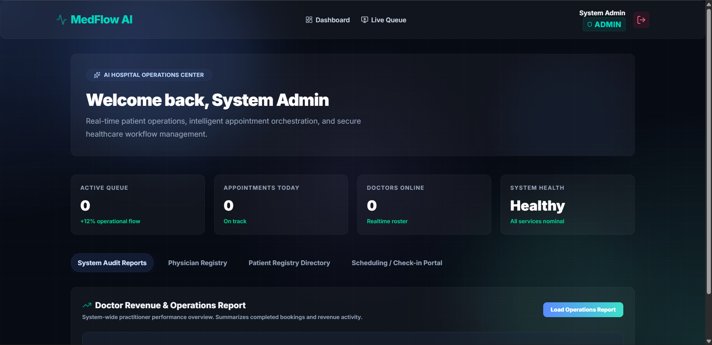
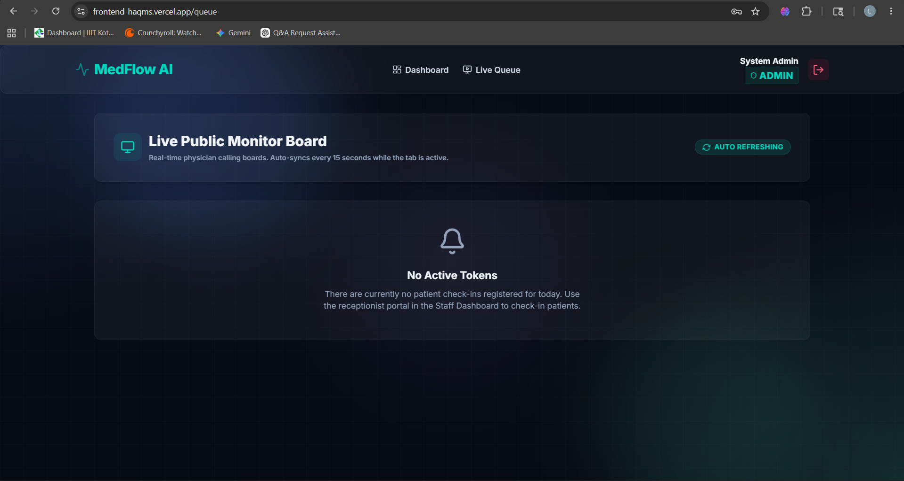
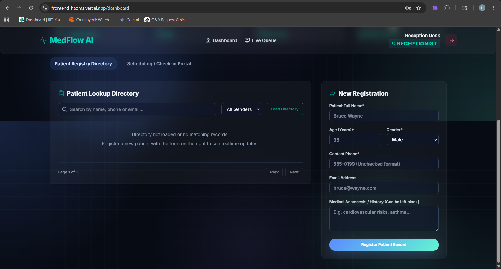
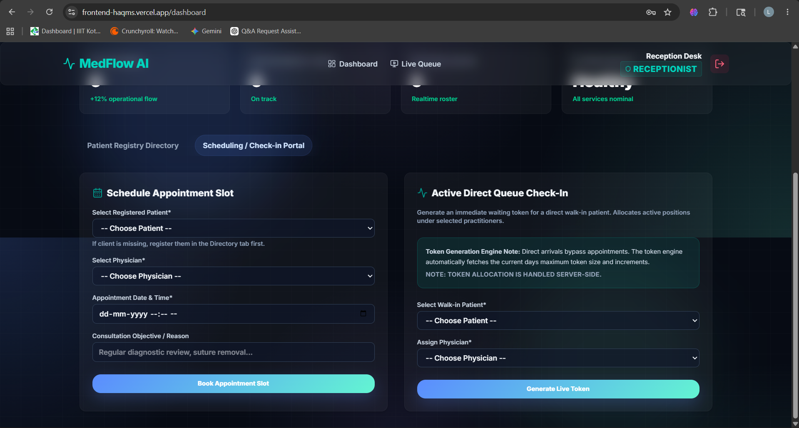
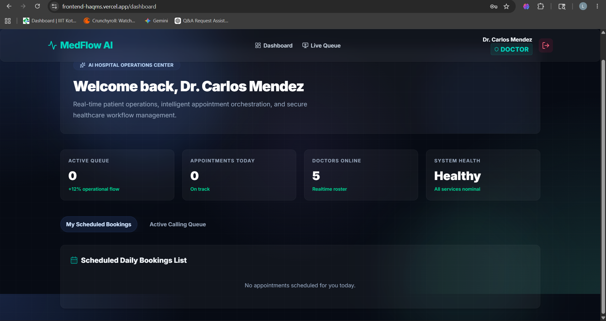

# HAQMS – Hospital Appointment & Queue Management System

HAQMS is a healthcare operations SaaS for appointment booking, patient registration, queue control, and role-based staff workflows.

## Features 
- Role-based authentication (Admin, Doctor, Receptionist) 
- Patient registration and management
- Appointment scheduling workflow
- Live queue and token management
- Doctor dashboard and appointment tracking
- Clinical history records
- Queue calling and status updates
- Pagination and filtering for patient registry
- Secure Prisma/PostgreSQL backend
- Responsive modern dashboard UI
- Production deployment using Railway and Vercel

## Architecture

- Frontend: Next.js App Router + Tailwind CSS
- Backend: Express.js + Prisma ORM
- Database: PostgreSQL
- Deployment: Vercel for the frontend, Railway for the backend and database

## Repository Layout

- `frontend/` - Next.js client application
- `backend/` - Express API, Prisma schema, migrations, and seed scripts
- `docker-compose.yml` - Optional local PostgreSQL service
- `setup.sh` - Workspace bootstrap helper

## Environment Variables

### Backend

```env
NODE_ENV="production"
DATABASE_URL="postgresql://<user>:<password>@<host>:5432/<database>?schema=public"
JWT_SECRET="<set-on-railway>"
CORS_ORIGIN="https://<your-vercel-app>.vercel.app,https://<custom-domain>"
```

### Frontend

```env
NEXT_PUBLIC_API_BASE_URL="https://<your-railway-backend>.up.railway.app/api"
```

## Local Setup

1. Install dependencies.
2. Configure `backend/.env` and `frontend/.env.local` from the example files.
3. Start PostgreSQL locally or via Docker Compose.
4. Apply Prisma migrations and seed demo data.
5. Run the backend and frontend dev servers.

```bash
npm install
npm run install:all
npm run docker:db
npm run db:setup --prefix backend
npm run dev
```
## Live Deployment
Frontend: 
https://frontend-haqms.vercel.app/ 

Backend: 
https://backend-production-f2b27.up.railway.app/

## Deployment

### Railway backend

- Set `NODE_ENV=production`
- Set `DATABASE_URL` to the Railway Postgres connection string
- Set `JWT_SECRET` to a strong secret
- Set `CORS_ORIGIN` to the Vercel deployment URL and any custom domain
- Use `npm start` as the service start command
- Run `prisma migrate deploy` during startup or via Railway release command

### Vercel frontend

- Set `NEXT_PUBLIC_API_BASE_URL` to the Railway backend URL ending in `/api`
- Ensure the app is deployed as a standard Next.js App Router project
- Confirm the frontend domain is added to `CORS_ORIGIN` on the backend

## Production Checklist

- Login/logout works for all roles
- Queue generation and queue calling work correctly
- Appointment booking succeeds for receptionists and doctors
- Doctor search optimized for secure filtered querying
- Patient pagination is server-side
- Dashboard renders for admin, doctor, and receptionist roles
- No secrets are hardcoded in source files
- Responsive layouts hold up on mobile and desktop

## Engineering Improvements

- Prisma schema and migrations restored
- SQL injection in doctor search removed
- RBAC enforced for sensitive actions
- Queue token allocation made transactional
- N+1 appointment queries reduced
- Patient pagination moved to the database
- Frontend API wiring standardized through environment variables
- Public queue polling reduced and cleaned up
- Doctor history view now renders a real clinical record page

## Demo Accounts

The seed data includes the following users with the password `password123`:

- `admin@haqms.com` - Administrator
- `reception1@haqms.com` - Receptionist

## Notes

- The backend expects PostgreSQL and Prisma migrations to be available before startup.
- The frontend requires `NEXT_PUBLIC_API_BASE_URL` to point at the Railway backend.
- `setup.sh` is a convenience script for local bootstrap only.

## Application Preview







